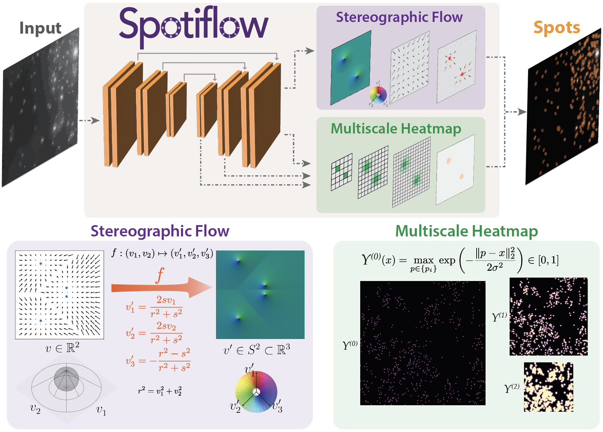

[](https://opensource.org/license/bsd-3-clause)
[](https://pypi.org/project/spotiflow)
[](https://python.org)
[](https://github.com/weigertlab/spotiflow/actions)
[](https://pypistats.org/packages/spotiflow)


---


# Spotiflow - accurate and efficient spot detection with stereographic flow

*Spotiflow* is a deep learning-based, threshold-agnostic, and subpixel-accurate spot detection method for fluorescence microscopy. It is primarily developed for spatial transcriptomics workflows that require transcript detection in large, multiplexed FISH-images, although it can also be used to detect spot-like structures in general fluorescence microscopy images. A more detailed description of the method can be found in [our paper](https://doi.org/10.1101/2024.02.01.578426).



The documentation of the software can be found [here](https://weigertlab.github.io/spotiflow/).

## Installation
Create and activate a fresh conda environment (we currently support Python 3.9 to 3.11):

```console
conda create -n spotiflow python=3.9
conda activate spotiflow
```


**Note (for MacOS users):** if using MacOS, there is a known bug causing the installation of PyTorch with `conda` to sometimes break OpenMP. You can avoid installing PyTorch with `conda` and let spotiflow install it automatically via `pip` instead.

For Linux/Windows with a CUDA device, install PyTorch using conda/mamba (one might need to change the cuda version accordingly):
```console
conda install pytorch torchvision pytorch-cuda=11.8 -c pytorch -c nvidia # Might need to change the cuda version accordingly
```

**Note (for Windows users):** if using Windows, please install the latest [Build Tools for Visual Studio](https://visualstudio.microsoft.com/downloads/#build-tools-for-visual-studio-2022) (make sure to select the C++ build tools during installation) before proceeding to install Spotiflow.


Finally, install `spotiflow`:

```console
pip install spotiflow
```


## Usage

### Training
See the [example training script](scripts/train.py) or the [example notebook](examples/1_train.ipynb) for an example of training. For finetuning an already pretrained model, please refer to the [finetuning example notebook](examples/3_finetune.ipynb).

### Inference (CLI)

You can use the CLI to run inference on an image or folder containing several images. To do that, you can use the following command:

```console
spotiflow-predict PATH
```

where PATH can be either an image or a folder. By default, the command will use the `general` pretrained model. You can specify a different model by using the `--pretrained-model` flag. Moreover, spots are saved to a subfolder `spotiflow_results` created inside the input folder (this can be changed with the `--out-dir` flag). For more information, please refer to the help message of the CLI (`$ spotiflow-predict -h`).

### Inference (API)

The API allows detecting spots in a new image in a few lines of code! Please check the [corresponding example notebook](examples/2_inference.ipynb) and the documentation for a more in-depth explanation.

```python
from spotiflow.model import Spotiflow
from spotiflow.sample_data import test_image_hybiss_2d

# Load sample image
img = test_image_hybiss_2d()
# Or any other image
# img = tifffile.imread("myimage.tif")

# Load a pretrained model
model = Spotiflow.from_pretrained("general")
# Or load your own trained model from folder
# model = Spotiflow.from_folder("./mymodel")

# Predict
points, details = model.predict(img) # points contains the coordinates of the detected spots, the attributes 'heatmap' and 'flow' of `details` contains the predicted full resolution heatmap and the prediction of the stereographic flow respectively (access them by `details.heatmap` or `details.flow`).
```

### Napari plugin
Our napari plugin allows detecting spots directly with an easy-to-use UI. See [napari-spotiflow](https://github.com/weigertlab/napari-spotiflow) for more information.


## For developers

We are open to contributions, and we indeed very much encourage them! Make sure that existing tests pass before submitting a PR, as well as adding new tests/updating the documentation accordingly for new features.

### Testing

First, clone the repository:
```console
git clone git@github.com:weigertlab/spotiflow.git
```

Then install the `testing` extras:

```console
cd spotiflow
pip install -e ".[testing]"
```

then run the tests:

```console
pytest -v --color=yes --cov=spotiflow
```

### Docs

Install the `docs` extras:

```console
pip install -e ".[docs]"
```

and then `cd` into the `docs` folder of the cloned repository and build them:
```console
cd spotiflow/docs
sphinx-build -M html source build
```

## How to cite
If you use this code in your research, please cite [the Spotiflow paper](https://doi.org/10.1101/2024.02.01.578426) (currently preprint):

```bibtex
@article {dominguezmantes24,
	author = {Albert Dominguez Mantes and Antonio Herrera and Irina Khven and Anjalie Schlaeppi and Eftychia Kyriacou and Georgios Tsissios and Can Aztekin and Joachim Ligner and Gioele La Manno and Martin Weigert},
	title = {Spotiflow: accurate and efficient spot detection for imaging-based spatial transcriptomics with stereographic flow regression},
	elocation-id = {2024.02.01.578426},
	year = {2024},
	doi = {10.1101/2024.02.01.578426},
	publisher = {Cold Spring Harbor Laboratory},
 URL = {https://www.biorxiv.org/content/early/2024/02/05/2024.02.01.578426},
	eprint = {https://www.biorxiv.org/content/early/2024/02/05/2024.02.01.578426.full.pdf},
	journal = {bioRxiv}
}
```
